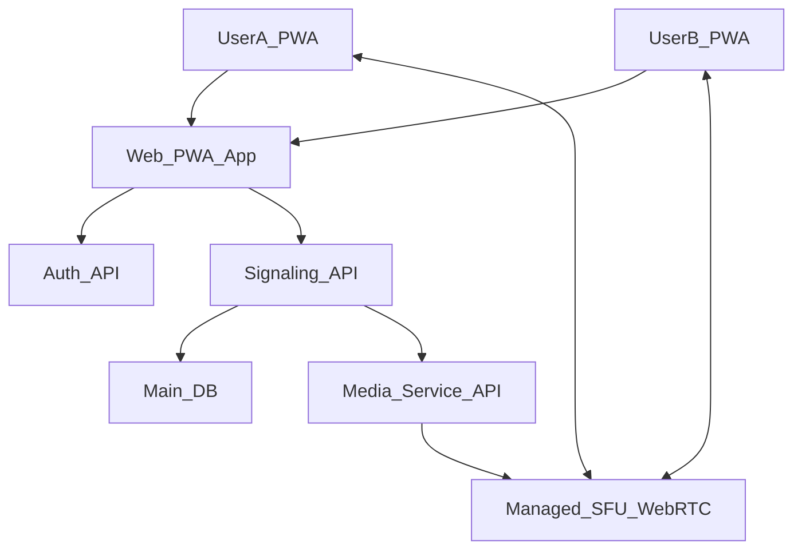

# NoMax
## Цели

- **Голосовые звонки 1‑на‑1 и небольшие группы (до ~5 человек)** через веб/PWA для близких людей.
- **Бекенд на Python** (FastAPI или Django) для сигналинга, авторизации и бизнес‑логики.
- **Медиа‑трафик через WebRTC**, с использованием управляемого сервиса (например, LiveKit Cloud, Daily, Twilio) как SFU/медиа‑сервер.
- **Фронтенд как веб‑клиент + PWA**, оптимизированный под мобильные браузеры.

## Высокоуровневая архитектура

- **PWA‑клиент**: отвечает за UI, установку как «почти нативного» приложения, работу с микрофоном, WebRTC‑пиры, интеграцию с внешним медиа‑сервисом.
- **Python‑бекенд**: auth, хранение пользователей/связей, создание «комнат»/звонков, REST/WebSocket‑сигналинг, интеграция с управляемым SFU.
- **Управляемый медиа‑сервис**: масштабируемая передача аудио для 1‑на‑1 и групп, запись/аналитика (по желанию).

## Бекенд (Python) — компоненты

- **Стек**:
  - **FastAPI** (или Django + Django Channels, но FastAPI проще для старта с WebSocket‑сигналингом).
  - Uvicorn/Gunicorn как ASGI‑сервер.
  - Postgres как основная БД.
  - Redis для сессий/short‑lived токенов/сигналинга (по мере роста).
- **Основные сущности**:
  - **User**: профиль, идентификатор, публичные поля для отображения.
  - **Relationship** (или `Circle`/`Group`): логика «близких» людей, кого можно вызвать.
  - **CallRoom**:
    - id, тип (1‑on‑1, group), статус (pending/active/ended), участники.
    - ссылка или `room_name`/`room_id` в медиа‑сервисе.
- **API‑слои**:
  - **Auth API**:
    - Регистрация/логин (email/phone/magic link, OAuth — выбрать 1 способ для MVP).
    - Выдача `access_token` (JWT) для фронтенда.
  - **Contacts/Relationships API**:
    - Получить список близких.
    - Отправить/принять приглашение.
  - **Calls/Rooms API**:
    - `POST /calls` — создать комнату (1‑on‑1 или group), вернуться с идентификатором комнаты и токеном/параметрами для медиа‑сервиса.
    - `POST /calls/{id}/join` — присоединиться к комнате, получить WebRTC/медиа‑параметры (через интеграцию с сервисом).
    - `POST /calls/{id}/end` — завершить звонок.
  - **Signaling WebSocket**:
    - Канал для обновлений статуса звонка, приглашений, присутствия, опционально для WebRTC‑сигналинга (если не полностью делегируем его медиа‑сервису).
- **Интеграция с медиа‑сервисом** (Managed SFU):
  - Обёртка‑клиент в Python для LiveKit/Twilio/Daily API.
  - Функции: создать комнату, сгенерировать участнику токен, завершить комнату, получить статистику (по мере необходимости).

## Фронтенд (Web + PWA)

- **Стек**:
  - React/Vue/Svelte — любой современный SPA‑фреймворк (по умолчанию можно выбрать React).
  - TypeScript.
  - PWA: `manifest.json`, `service worker`, оффлайн‑кеш базового UI и иконки.
- **Главные экраны/фичи**:
  - **Онбординг и логин**.
  - **Список «близких»** (контакты/малые группы) с индикацией онлайн‑статуса.
  - **Экран звонка**:
    - Кнопки: mute, выход, возможно — громкая связь.
    - Отображение участников (для групп).
    - Индикатор качества соединения (позже).
- **WebRTC‑слой на фронте**:
  - Обёртка вокруг WebRTC/SDK управляемого сервиса.
  - Логика создания/подключения к комнате на основе данных от Python‑бекенда.
  - Работа с `getUserMedia` (только аудио), управление разрешениями.
- **PWA‑особенности для звонков**:
  - Установка PWA на домашний экран.
  - Обработка пуш‑уведомлений (Web Push / интеграция с Firebase Cloud Messaging) для входящих звонков.
  - Переход в экран звонка при тапе на уведомление.

## Потоки данных (основные сценарии)

- **Исходящий вызов 1‑на‑1**:
  1. Пользователь A в PWA выбирает контакт B.
  2. PWA вызывает `POST /calls` с типом `one_to_one` и участниками [A,B].
  3. Python‑бекенд создаёт `CallRoom` в БД и комнату в медиа‑сервисе, возвращает фронту room_id + токен A.
  4. Python‑бекенд отправляет через WebSocket/Push уведомление пользователю B о входящем вызове (с `call_id`).
  5. PWA у B показывает UI «Входящий звонок»; при ответе — запрос `POST /calls/{id}/join`.
  6. Оба клиента подключаются к комнате через WebRTC/SDK.
  7. Завершение — `POST /calls/{id}/end` или таймаут.
- **Групповой вызов (до 5 участников)**: аналогично, но в `CallRoom` несколько участников; каждый подключается/отключается независимо; медиа‑сервис (SFU) микширует/распределяет аудио.

## Безопасность и конфиденциальность (базовый уровень)

- **Транспорт**: всё общение PWA ↔ Python ↔ медиа‑сервис — только по HTTPS/WSS.
- **Auth**:
  - JWT‑токены для REST и WebSocket.
  - Проверка прав доступа к каждой комнате (участник ли пользователь).
- **WebRTC**: использует встроенное DTLS‑SRTP шифрование между клиентами и SFU.
- **Минимизация данных**: в медиа‑сервис уходит только минимум метаданных (id комнаты/пользователя), без лишней личной информации.

## Этапы реализации (итерации)

- **Итерация 1 — каркас без реальных звонков**:
  - Поднять Python‑бекенд (FastAPI), реализовать базовый Auth + Users + Relationships.
  - Сделать простой React‑PWA: логин, список «близких», заглушки кнопок «Позвонить».
  - Настроить WebSocket‑канал для сигналов «входящий/исходящий звонок» (без медиа).
- **Итерация 2 — интеграция с медиа‑сервисом и голос 1‑на‑1**:
  - Выбрать и подключить managed WebRTC‑провайдера (LiveKit Cloud / Daily / Twilio Video).
  - Реализовать создание комнат и генерацию токенов на Python‑бекенде.
  - Реализовать на фронтенде подключение по токену, получение/отправку аудио.
- **Итерация 3 — групповые звонки и улучшение UX**:
  - Добавить поддержку до 5 участников в `CallRoom` и на фронте.
  - Улучшить UI звонка (список участников, mute per user и т.д.).
  - Добавить базовую индикацию качества соединения/переподключения.
- **Итерация 4 — PWA‑фишки и нотификации**:
  - Подключить Web Push/FCM для входящих звонков.
  - Улучшить работу на мобильных браузерах (background, экран блокировки в пределах возможного для PWA).

## Todos

- **backend-bootstrap**: Поднять проект на FastAPI с базовой авторизацией и моделями пользователей/отношений.
- **call-domain-model**: Спроектировать модели и API для `CallRoom` и сигналинга (REST + WebSocket).
- **media-service-selection**: Выбрать и описать конкретный managed WebRTC‑сервис (LiveKit/Daily/Twilio) с учётом цен/SDK.
- **frontend-pwa-shell**: Создать PWA‑shell (React+TS), базовую навигацию и экраны логина/списка «близких».
- **webrtc-integration**: Реализовать интеграцию фронтенда и Python‑бекенда с выбранным медиа‑сервисом для аудио 1‑на‑1.
- **group-calls-ux**: Расширить доменную модель и UI под групповые звонки и улучшенный UX.
- **notifications-pwa**: Добавить Web Push/FCM и связать входящие звонки с нотификациями на мобильных устройствах.

