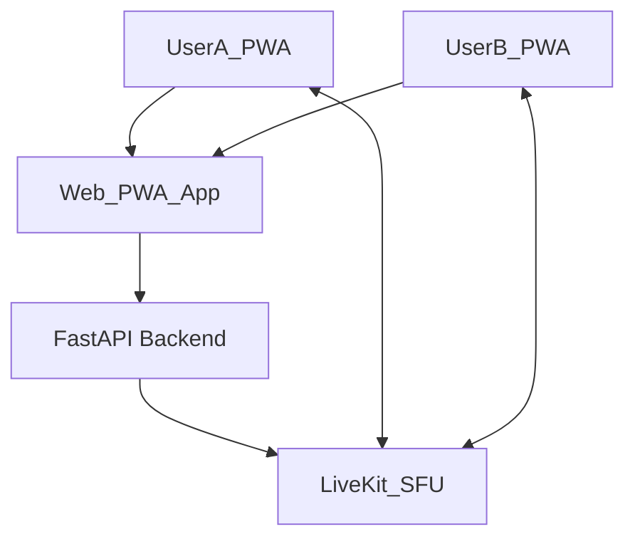

# NoMax

## Описание

NoMax — небольшое приложение для голосовых звонков 1‑на‑1 (и малых групп в будущем) для близких людей.  
Стек:

- **Бекенд**: FastAPI (Python), REST + WebSocket‑сигналинг, JWT‑авторизация.
- **Медиа‑часть**: self‑hosted **LiveKit** SFU в Docker.
- **Фронтенд**: минимальный веб/PWA‑клиент на чистом HTML/JS, разворачиваемый через Nginx (Docker).

Все сервисы поднимаются одной командой `docker compose up -d --build`.

## Архитектура



- **PWA‑клиент**:
  - экран логина/регистрации;
  - список «близких» с кнопкой «Позвонить»;
  - отображение «Текущего звонка» и подключение к комнате в LiveKit.
- **Python‑бекенд**:
  - авторизация/регистрация и JWT токены;
  - сущности `User`, `Relationship`, `CallRoom`;
  - REST‑эндпоинты для управления звонками;
  - WebSocket‑канал для сигналинга (на будущее).
- **LiveKit**:
  - self‑hosted SFU в Docker;
  - бекенд генерирует JWT‑токены для подключения к комнатам;
  - фронтенд подключается к LiveKit через JS‑SDK.

## Бекенд (FastAPI)

- Расположение: `main.py`, `auth.py`, `models.py`, `media.py`.

- **Основные сущности**:
  - `User`: id, username, hashed_password, full_name (in‑memory storage на текущее MVP).
  - `Relationship`: связи «владатель → близкий».
  - `CallRoom`: id, type (`one_to_one`/`group`), status (`pending`/`active`/`ended`), участники, `media_room_id`.

- **Ключевые эндпоинты**:
  - Auth:
    - `POST /auth/register` — регистрация пользователя (username + password).
    - `POST /auth/token` — получение JWT токена по `OAuth2PasswordRequestForm`.
    - `GET /me` — текущий пользователь.
  - Контакты:
    - `POST /relationships?username=...` — добавить «близкого».
    - `GET /relationships` — список «близких».
  - Звонки:
    - `POST /calls` — создать `CallRoom`, сгенерировать LiveKit‑комнату и `media_token` для создателя.
    - `POST /calls/{id}/join` — присоединиться к звонку, выдать участнику `media_token`.
    - `POST /calls/{id}/end` — завершить звонок (для владельца).
  - Сигналинг:
    - `WS /ws/signaling` — простой хаб: регистрация по `from_user_id` и форвардинг сообщений (для дальнейшего обмена SDP/ICE).

- **Интеграция с LiveKit** (`media.py`):
  - Читает конфиг из env:
    - `LIVEKIT_API_KEY`
    - `LIVEKIT_API_SECRET`
    - `LIVEKIT_HOST`
  - Функция `build_livekit_access_token(identity, room_name)` — создаёт JWT под LiveKit.

## Фронтенд (PWA‑клиент)

- Расположение: `frontend/index.html`, `frontend/manifest.json`, `frontend/service-worker.js`, `frontend/favicon.svg`.
- Стэк:
  - Чистый HTML + JS;
  - LiveKit JS‑SDK через CDN (`livekit-client.umd.min.js`);
  - PWA‑манифест + сервис‑воркер для кэша shell’а.

- **Основной флоу**:
  1. Пользователь заходит на `http://localhost:3000`.
  2. Регистрируется/логинится → фронт получает `access_token` через `/auth/token`.
  3. Тянет список «близких» через `/relationships`.
  4. Нажимает «Позвонить»:
     - фронт вызывает `POST /calls`;
     - бекенд создаёт комнату, генерирует `media_room` + `media_token`;
     - фронт вызывает `ensureLiveKitConnected(call)`:
       - подключается к LiveKit (`ws://localhost:7880`) по токену;
       - публикует локальный аудиотрек;
       - подписывается на входящие аудио‑треки и проигрывает их через скрытый `<audio>`.

## Инфраструктура и запуск

### Docker‑файлы

- `Dockerfile` — бекенд (FastAPI + Uvicorn):
  - Python 3.11 slim;
  - `requirements.txt` (`fastapi`, `uvicorn`, `python-jose`, `passlib`, `python-multipart`).
- `Dockerfile.frontend` — Nginx, раздаёт `frontend/`.

### LiveKit (self‑hosted)

- Конфиг: `infra/livekit/livekit.yaml` (минимальная локальная конфигурация).
- Сервис `livekit` в `docker-compose.yml`:
  - образ `livekit/livekit-server:latest`;
  - старт с `--config /livekit/livekit.yaml`;
  - монтирование конфигурации из `infra/livekit/livekit.yaml`;
  - проброс портов:
    - `7880:7880` — WebSocket (без TLS) для локальной разработки;
    - `7881:7881` — TCP/RTCP (по необходимости).

### docker-compose

- Файл: `docker-compose.yml`.
- Сервисы:
  - `backend`:
    - билд из `Dockerfile`;
    - порты: `8000:8000`;
    - env:
      - `PYTHONUNBUFFERED=1`
      - `LIVEKIT_API_KEY=devkey`
      - `LIVEKIT_API_SECRET=devsecret`
      - `LIVEKIT_HOST=ws://livekit:7880`
  - `frontend`:
    - билд из `Dockerfile.frontend`;
    - порты: `3000:80`;
    - завязан на `backend`.
  - `livekit`:
    - образ `livekit/livekit-server:latest`;
    - конфиг из `infra/livekit/livekit.yaml`.

### Команды запуска

- Собрать и поднять всё:

```bash
docker compose up -d --build
```

- Проверить:
  - Бекенд: `http://localhost:8000/docs`
  - Фронтенд (PWA): `http://localhost:3000`

## Планы развития

- **Групповые звонки** до ~5 человек (расширение `CallRoom` и UX).
- **Лучший UX звонка**: mute, статус по каждому участнику, переподключение.
- **Web Push / FCM** для входящих звонков.
- Перенос фронта на полноценный **React/TypeScript** поверх текущего API/инфры.


